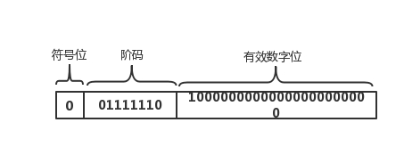
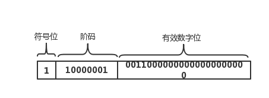

# IEEE二进位浮点数算术标准(IEEE754)

20世纪80年代以来最广泛使用的浮点数运算标准，为许多CPU与浮点运算器所采用。
IEEE 754规定了四种表示浮点数值的方式：单精确度（32位）、双精确度（64位）、延伸单精确度（43比特以上，很少使用）与延伸双精确度（79比特以上，通常以80位实现）。
Javascript 采用的正是 IEEE 754 双精度浮点数；


一个浮点数 (Value) 的表示其实可以这样表示：

```
value = sign * exponent * fraction
```

也就是浮点数的实际值，等于符号位（sign bit）乘以指数偏移值(exponent bias)再乘以分数值(fraction)。

符号（sign）：决定该数的正负, 0 为正、1 为负
分数值/有效数字/尾部（fraction）：是一个二进制小数
阶码（exponent）：E对浮点数加权或者称之为指数

### **浮点数0.75单精度示例**

计算符号位：
0.75是正数，所以符号位为0。

计算阶码：
0.75用二进制表示是0.11，转为科学计数法就是1.1\*2^-1(也就是都要转为1.xxx\*2^e)。
这里我们知道了指数为-1，我们现在根据-1算出阶码。IEEE754 规定在单精度中，阶码占用8个bit，那么最大值是11111111=255，这255里既要表示正数又要表示负数，那么得出 255/2=127=01111111=0,那么-1即是126，那么126转为二进制01111110，就是我们算出的阶码。

计算分数值/有效数字：
0.75用二进制的科学计数法得出 1.1\*2^-1，1.1的点后面的有效数字为1，IEEE754 规定在单精度中，有效数字占用23个bit，
那么得出有效数字位 10000000000000000000000。

0.75的单精度浮点表示如下：


### **浮点数-4.75单精度示例**

计算符号位：
-4.75是负数，符号位为1。

计算阶码：
这里直接去掉-号，用4.75转为二进制=100.11，二进制科学计数法表示=1.0011\*2^2，得到指数2，01111111=127表示0，根据2+127=129=10000001,得到阶码10000001。

计算分数值/有效数字：
根据1.0011\*2^2得到有效数字0011。那么有效数字位即是00110000000000000000000。

-4.75的单精度浮点表示如下：



|类型|符号位|阶码|有效数字位|
|---|-----|----|--------|
|单精度|1bit|8bit|23bit|
|双精度|1bit|11bit|52bit|
