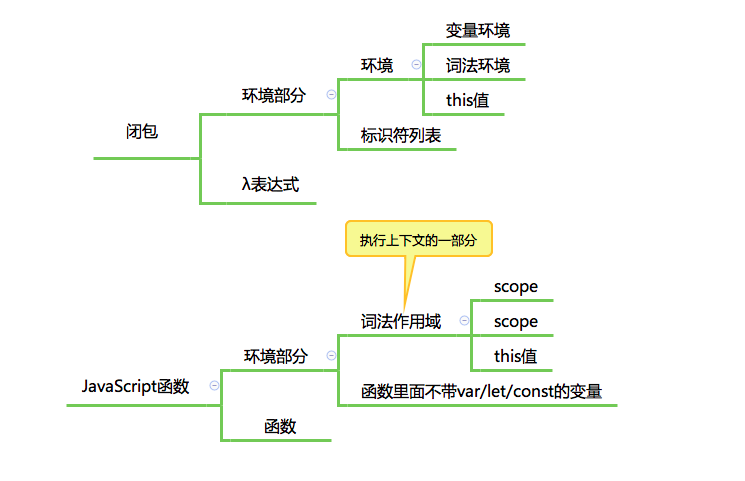

# 闭包和执行上下文

函数执行过程:

### 名词解释

**Lambda：** Lambda 表达式，又称 λ 表达式。Lambda表达式基于数学中的λ演算得名。在早期的主流的编程语言是基于 lambda 演算的函数式编程语言，所以这个最初的闭包定义，使用了大量的函数式术语。一个不太精确的描述是“带有一系列信息的λ表达式”。对函数式语言而言，λ表达式其实就是函数。

**词法环境：**
待补充

**闭包：** 闭包其实只是一个绑定了执行环境的函数，这个函数并不是印在书本里的一条简单的表达式，闭包与普通函数的区别是，它携带了<u>执行的环境</u>，就像人在外星中需要自带吸氧的装备一样，这个函数也带有在程序中生存的环境。

这个古典的闭包定义中，闭包包含两个部分:

- 环境部分
    - 环境
    - 标识符列表
- 表达式部分

JavaScript 的标准中的闭包：

- 环境部分
    - 环境：函数的词法环境（执行上下文的一部分）
    - 标识符列表：函数中用到的未声明的变量
- 表达式部分：函数体