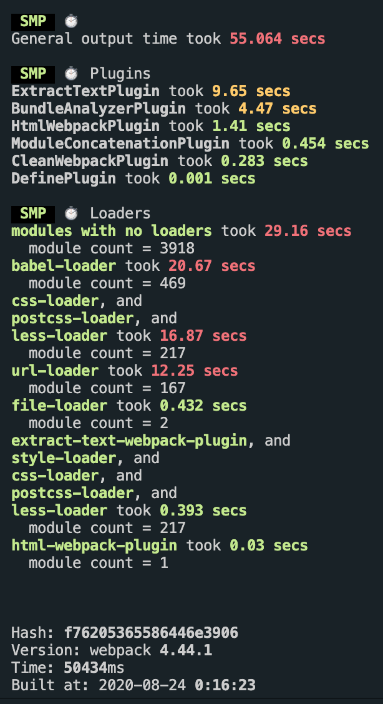
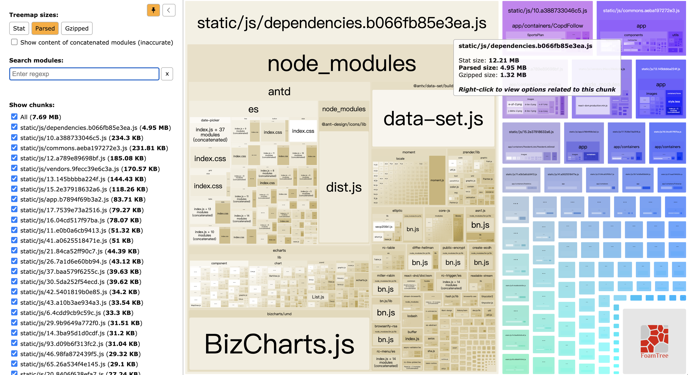
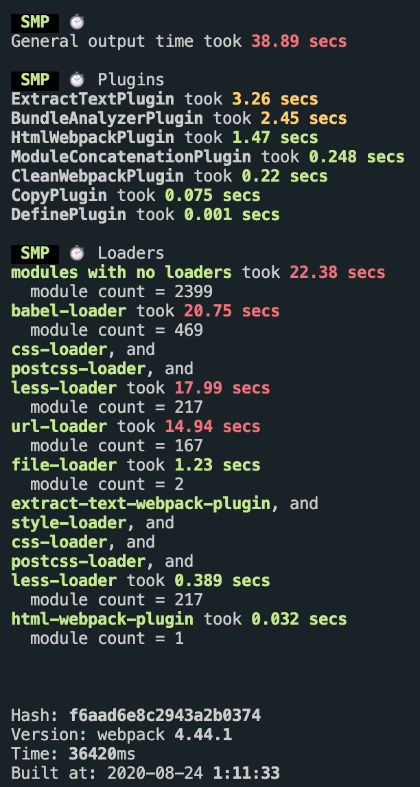
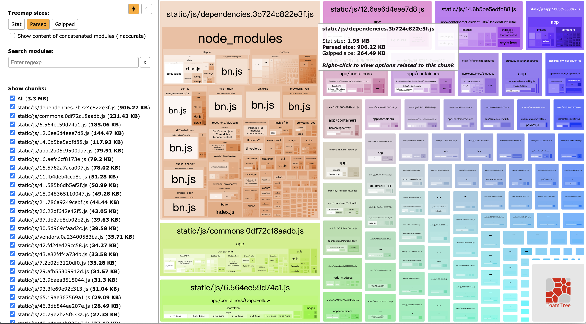
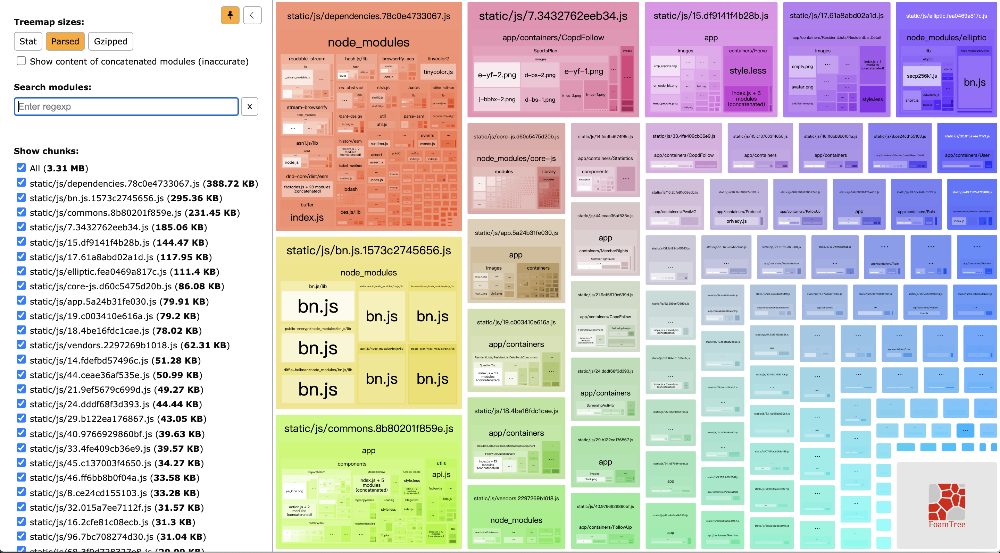
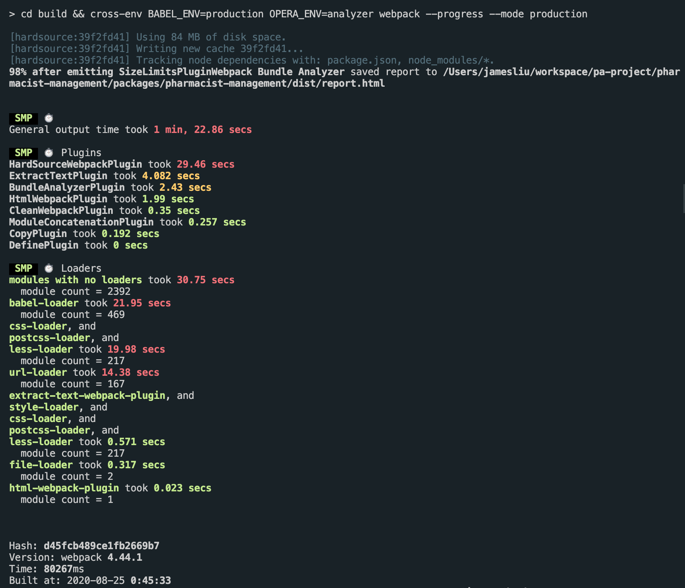
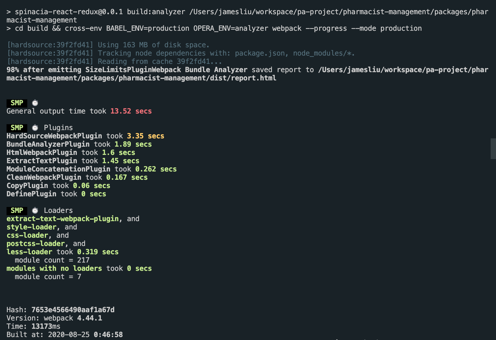

## 分析现状

C端应用一般不容易出现巨石应用，但是B端比较容易出现巨石应用，除了微前端，在大改前，我们可以先试着对项目测量其打包体积、速度等，量化现状，建立优化的指标。

## 指标建立

#### speed-measure-webpack-plugin 
测量构建速度
<p align='center'>

</p>

##### 瓶颈：

常规代码耗时
```shell
General output time took 55.064 secs
```
Loaders 耗时
```shell
modules with no loaders took 29.16 secs
  module count = 3918
babel-loader took 20.67 secs
  module count = 469
css-loader, and 
postcss-loader, and 
less-loader took 16.87 secs
  module count = 217
url-loader took 12.25 secs
  module count = 167
```

#### webpack-bundle-analyzer 
测量构建后各个模块或包的体积

<p align='center'>

</p>

##### 瓶颈：

> static/js/dependencies.b066fb85e3ea.js (4.95 MB)
>    - antd
>    - data-set.js
>    - echarts
>    - BizCharts.js

### 分析与优化

从测量结果来看，构建时间上，常规代码花去了最长时间，其次部分loader也花了较长时间。而在打包体积上，node_modules/** 里面的代码占去了代码总量的大部分的体积。

所以我们这里第一步在构建速度上通过使用 happypack 来实现多核并发打包，提高速度，同时使用 externals 或者 DllPlugin 、HardSourceWebpackPlugin 等插件减少构建代码的体量，达到提高打包速度的目的。
代码体积上，我们通过 splitChunk 分离 antd、data-set.js、echarts、BizCharts.js 等几个过大的包，开启http缓存来提高用户访问前端界面的速度。

##### 拆包

根据 webpack-bundle-analyzer 分析，首先我们使用 externals 来把部分比较大的包拆分出来，在编译过程中排除这几个包：

```js
externals: function(context, request, callback) {
    if (/^react$/.test(request))
      return callback(null, 'React');
    if (/^react-dom$/.test(request))
      return callback(null, 'ReactDOM');
    if (/^@antv\/data-set$/.test(request))
      return callback(null, 'DataSet');
    if (/^moment$/.test(request))
      return callback(null, 'moment');
    if (/^antd$/.test(request))
      return callback(null, 'antd');
    if (/^echarts$/.test(request))
      return callback(null, 'echarts');
    if (/^bizcharts$/.test(request))
      return callback(null, 'BizCharts');
    callback();
  }
  ```
然后我们再测试下打包时间：  

<p align='center'>
    
</p>

可以看到，排除了几个体积较大的包后，速度还是有一定的提升的。
我们再看下代码体积：

<p align='center'>

</p>

dependencies 这个包体积从原来的 4.95MB 缩减到 906.22KB，这个优化效果还是很明显的。
为了进一步拆分，我们使用 splitChunks 把 elliptic、core-js 等几个大的包拆分，以减少包体积，最大化利用网络资源。

<p align='center'>

</p>


##### 构建缓存

对构建的结果做缓存处理。这里使用 HardSourceWebpackPlugin 插件来进行处理，它的优势是配置方便。

我们来看下使用缓存前的构建时间：

<p align='center'>

</p>

再看下使用缓存后的构建时间：

<p align='center'>

</p>


可以看到，构建总时长从原先的80s+降低到了13s+，提效明显。但是缺点是，第二次构建才会产生效果。


##### 多核处理

未完待续。。。